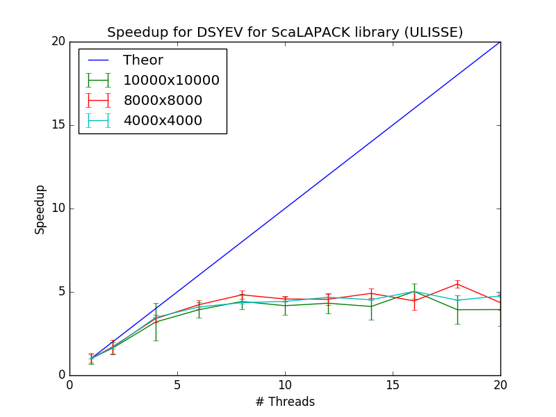
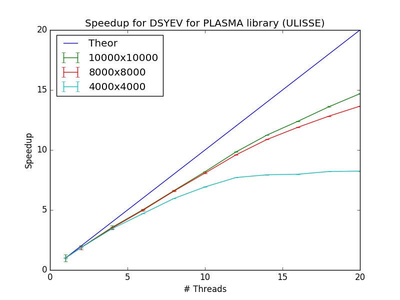

P1.7 Results
============

In this report I will present the results of the benchmarks done during the P1.7 course.
In the first part I show the tests done with different libraries (Intel MKL and OpenBLAS) and the performances obtained from three different functions.
Then I switch into the test of the DSYEV function on different machines to test scaling properties of the ScaLAPACK, PLASMA and MAGMA libraries.

Most of the plot that will be shown were obtained by repeating 6 (otherwise 10) times the same executable in order to have a bit of statistics.
Error bars associated with each point was obtained by calculating the standard deviation of these measures.

Intel MKL vs OpenBLAS
#####################

The purpose of this section is to compare the performances obtained from two different implementations of the following three particular functions:

**DAXPY**, that perform the following operation:

.. math::

   y = a * x + y;

where :math:`a` is a moltiplicative constant while :math:`x` and :math:`y` are vectors of dimension N. This function perform :math:`2 N` floating point operations.

**DGEMV**, that perform the following operation:

.. math::

   y = a * A * x + b * y;

where :math:`a` and :math:`b` are two moltiplicative constants while :math:`x` and :math:`y` are vectors of dimension N. This function perform :math:`2 N^2` floating point operations.

**DGEMM**, that perform the following operation:

.. math::

   C = a * A * B + b * C;

where :math:`a` and :math:`b` are two moltiplicative constants while :math:`A`, :math:`B` and :math:`C` are vectors of dimension N. This function perform :math:`2 N^3` floating point operations.

This functions are choosen because of their different scaling properties with respect to the size of the problem. In the following there is the results obtained on the ULISSE cluster:

.. image:: plots/mkl_vs_openblas.png

Both sources were compiled with gcc compiler and library statically linked. As one can see, the plot clearly shows that increasing the size of the matrix DAXPY and DGEMV
are memory bounded while DGEMM is compute bounded. For DAXPY and DGEMV and for matrix size less than 2500 the Intel MKL library
achieves better performances with respect to OpenBLAS, while for size greater than 2500 the performances are more or less the same.
This appens also for DGEMM for matrix size greater than 1000, while for matrix size less than 1000 seems that ObenBLAS achieves slightly
better performances with respect to Intel MKL.
	   

ScaLAPACK PDSYEV Benchmark
##########################

In this section I show the results for DSYEV function of ScaLAPACK library. This function calculates the eigenvalues (and eigenvectors optionally) for a given matrix.
ScaLAPACK is an implementation of a subset of LAPACK routines for distributed memory, and requires more complex data structures in order to perform the desidered operations.
In the case of DSYEV functionality, ScaLAPACK spawns the processes as in a "grid" and distributes the matrix among processes; this distribution is performed in order to obtain the best load balance
(taking into account computation and communication). To achieve the best performance we have to choose the grid configuration in witch spawn the processes in order to exploit the hardware available.

The following plot shows the execution time in function of the matrix size obtained on ULISSE cluster.

As one can see the best grid configuration is 2x10, that for a matrix 18000x18000 reduces for almost 20 % the execution time compared with the worst configuration (1x20).
This result is reasonable, because each ULISSE node has a dual socket CPU, and each socket has 10 cores and has it's own RAM.
A 2x10 processors grid allow to exploit this hardware configuration.

To confirm this result I've done the same test on COSINT cluster. Each COSINT node is equipped with a dual socket CPU, and each socket cpu has 12 cores.
The following plot shows the execution time in function of the matrix size obtained on COSINT cluster.

.. image:: plots/pdsyev_timing_cosint.png

As one can see in this case the best grid configuration is 4x6, while it was expected to be 2x12. Actually, the reason of this fatc is not totally clear and we should
carry out more extensive tests using commands like :code:`numactl`.

ScaLAPACK - PLASMA Comparison
#############################

In this section I show the results for the comparison between ScaLAPACK and PLASMA libraries. PLASMA is a library that contains a multithread implementation of some LAPACK routines.
In order to gain the scaling properties for ScaLAPACK I used the best configuration obtained in the previous section.
In the following three plots I shows the speedup obtained respectively for matrix size 4000, 8000, 10000:

As one can see DSYEV of PLASMA scale pretty well, while PDSYEV of ScaLAPACK not. In order to obtain a better visibility of the scaling properties as a function of the
matrix size, I also grouped the behaviours for PLASMA and ScaLAPACK libraries separately. These behaviours are showed in the following plots:

DSYEV of PLASMA scale pretty well with the size of the matrix.

